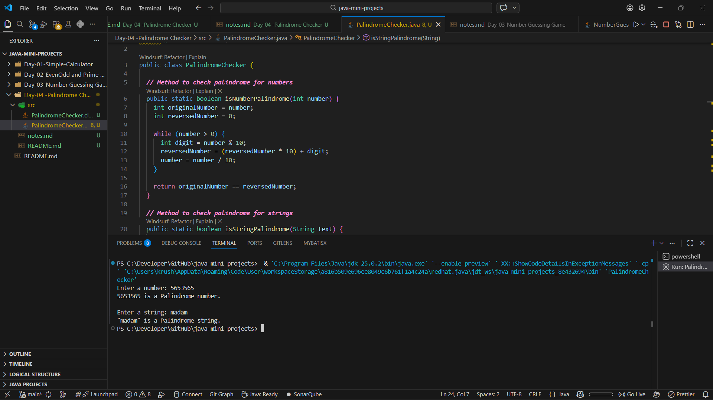

<div align="center">

# 📅 Day 04 — Palindrome Checker (String & Number)

### Strengthening String Handling & Reverse Logic in Java


</div>

---

## 🔗 Quick Navigation

- [🎯 Goal of the Day](#-goal-of-the-day)
- [🧠 Concepts Practiced](#-concepts-practiced)
- [🛠️ What I Built](#️-what-i-built)
- [📁 Folder Structure](#-folder-structure)
- [⚙️ Palindrome Logic Explained](#️-palindrome-logic-explained)
- [🖼️ Working Output](#️-working-output)
- [📝 Notes & Observations](#-notes--observations)
- [💡 Key Takeaways](#-key-takeaways)
- [🎯 Interview Preparation](#-interview-preparation-day-04-level)
- [⏭️ What’s Next?](#️-whats-next)

---

## 🎯 Goal of the Day

The goal of **Day 04** is to understand and implement **Palindrome checking logic** for:

- Numbers
- Strings

This project strengthens:

- Reverse logic
- String manipulation
- Comparison techniques
- Method-based problem solving

---

## 🧠 Concepts Practiced

### Core Java Concepts

- `String` handling
- Loops (`for`)
- Character comparison
- Mathematical reversal logic
- Methods for code clarity

### Logical Skills

- Breaking input into components
- Comparing original vs reversed values
- Handling both numeric and textual data

---

## 🛠️ What I Built

I built a **console-based Palindrome Checker** that:

- Accepts a number from the user
- Accepts a string from the user
- Checks whether each input is a palindrome
- Displays clear results for both cases

📌 Handles numbers and strings  
📌 Uses clean, readable logic  
📌 Beginner-friendly implementation

---

## 📁 Folder Structure

Day-04-Palindrome-Checker/<br>
├── README.md<br>
├── NOTES.md<br>
├── assets/<br>
│ └── output.png<br>
└── src/<br>
└── PalindromeChecker.java

---

## ⚙️ Palindrome Logic Explained

For Numbers
Store the original number

Reverse the number using a loop

Compare reversed number with original

For Strings
Reverse the string character by character

Compare reversed string with original

If both match → Palindrome

This approach keeps the logic simple and interview-safe.

---

## 🖼️ Working Output

📸 Example execution:

👉 View Output Screenshot

## 

## 📝 Notes & Observations

Reversal logic improves problem-solving ability

Strings and numbers require different handling

Writing separate methods improves readability

Clean logic matters more than shortcuts

## 💡 Key Takeaways

Palindrome problems test logical clarity

Reverse logic is common in interviews

Method-based solutions are easier to maintain

Understanding basics prevents future confusion

## 🎯 Interview Preparation (Day 04 Level)

Q1. What is a palindrome?
A palindrome is a value that reads the same forward and backward.

Q2. How do you check palindrome for a number?
By reversing the number and comparing it with the original.

Q3. How is string palindrome checking different?
Strings are reversed using characters instead of mathematical operations.

Q4. Why store the original value?
Because the input changes during reversal and needs comparison.

## ⏭️ What’s Next?

<div align="center">
👉 Day 05 – Simple Interest & EMI Calculator
Focus areas:

Mathematical formulas

Method-based calculations

Real-world finance logic

<br/>
➡️ Go to Day 05

</div>
```
