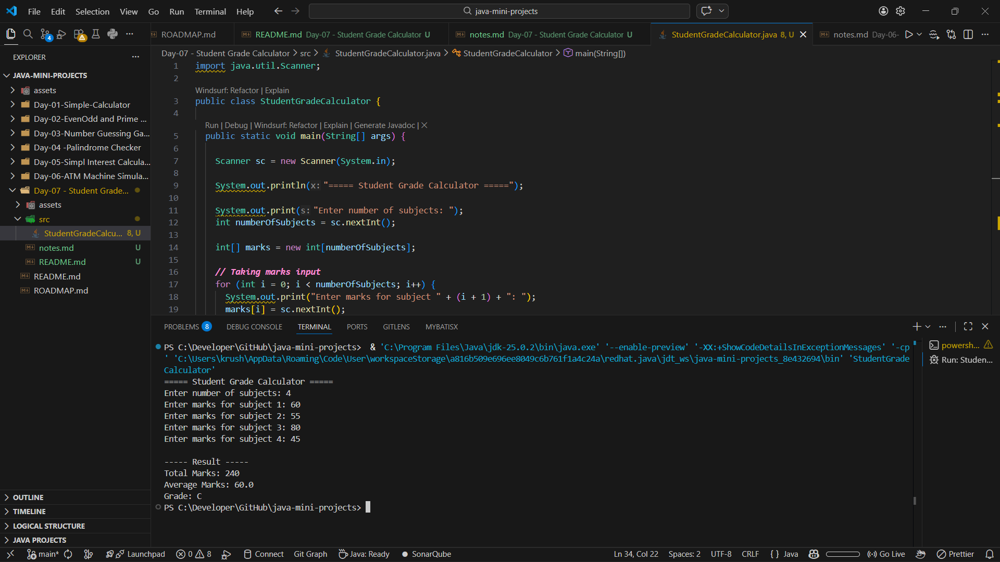

# 📅 Day 07 — Student Grade Calculator

### Working with Arrays & Grading Logic in Java

---

## 🔗 Quick Navigation

- [🎯 Goal of the Day](#-goal-of-the-day)
- [🧠 Concepts Practiced](#-concepts-practiced)
- [📊 What I Built](#-what-i-built)
- [📁 Folder Structure](#-folder-structure)
- [⚙️ Program Logic Explained](#️-program-logic-explained)
- [🖼️ Working Output](#️-working-output)
- [📝 Notes & Observations](#-notes--observations)
- [💡 Key Takeaways](#-key-takeaways)
- [🎯 Interview Preparation](#-interview-preparation-day-07-level)
- [⏭️ What’s Next?](#️-whats-next)

---

## 🎯 Goal of the Day

The goal of **Day 07** is to build a **Student Grade Calculator** using arrays to:

- Store multiple subject marks
- Calculate total and average
- Assign grades based on average
- Strengthen array-based thinking

This project moves from single-variable logic to **multi-value data handling**.

---

## 🧠 Concepts Practiced

### Core Java Concepts

- Arrays
- `for` loop
- Arithmetic operations
- Conditional statements (`if-else`)
- User input using `Scanner`

### Logical Skills

- Storing multiple values
- Calculating average
- Designing grading conditions
- Aggregating data

---

## 📊 What I Built

I built a **Student Grade Calculator** where:

- User enters marks for multiple subjects
- Program calculates:
  - Total Marks
  - Average Marks
- Based on average, a grade is assigned:
  - A Grade
  - B Grade
  - C Grade
  - Fail

📌 Array-based storage  
📌 Real academic grading logic  
📌 Structured and clean output

---

## 📁 Folder Structure

Day-07-Student-Grade-Calculator/  
├── README.md  
├── NOTES.md  
├── assets/  
│ └── output.png  
└── src/  
 └── StudentGradeCalculator.java

---

<h2>⚙️ Program Logic Explained</h2>

Ask user for number of subjects

Create an array to store marks

Use a loop to take marks input

Calculate total using loop

Find average:

Average = Total / Number of Subjects

Assign grade using conditions:

90+ → Grade A  
75–89 → Grade B  
50–74 → Grade C  
Below 50 → Fail

Display total, average, and grade

This demonstrates data aggregation using arrays.

---

<h2>🖼️ Working Output</h2>

📸 Example program run:

👉 View Output Screenshot

---

<h2>📝 Notes & Observations</h2>

Arrays allow storing multiple values in one variable

Loops simplify repeated input collection

Average calculation requires proper type handling

Structured grading improves logical thinking

---

<h2>💡 Key Takeaways</h2>

Arrays are essential for handling grouped data

Loop + Array combination is powerful

Conditions define system rules

Clean logic improves readability

---

<h2>🎯 Interview Preparation (Day 07 Level)</h2>

Q1. Why do we use arrays in this project?  
To store multiple subject marks efficiently.

Q2. What happens if we don’t use a loop for input?  
We would need separate variables for each subject.

Q3. Why is average calculated using total/size?  
Because average represents the mean of all values.

Q4. How can this project be improved?  
By adding grade distribution, highest/lowest marks, or percentage formatting.

---

## ⏭️ What’s Next?

👉 Day 08 – Factorial & Fibonacci Series  
Focus areas:

Recursion

Mathematical logic

Function-based design

 
➡️ Go to Day 08

