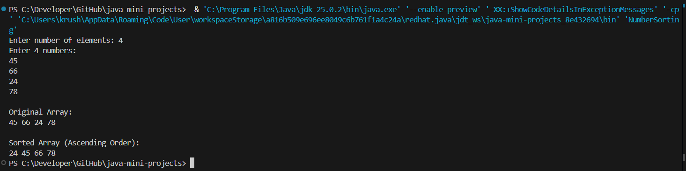

# 📅 Day 10 — Number Sorting

### Understanding Arrays & Sorting Logic in Java

---

## 🔗 Quick Navigation

- [🎯 Goal of the Day](#-goal-of-the-day)
- [🧠 Concepts Practiced](#-concepts-practiced)
- [🔢 What I Built](#-what-i-built)
- [📁 Folder Structure](#-folder-structure)
- [⚙️ Sorting Logic Explained](#️-sorting-logic-explained)
- [🖼️ Working Output](#️-working-output)
- [📝 Notes & Observations](#-notes--observations)
- [💡 Key Takeaways](#-key-takeaways)
- [🎯 Interview Preparation](#-interview-preparation-day-10-level)
- [⏭️ What’s Next?](#️-whats-next)

---

## 🎯 Goal of the Day

The goal of **Day 10** is to understand how **arrays can be used to store multiple values** and how to **sort numbers using logic-based comparison**.

This introduces:

- Data organization
- Element comparison
- Basic sorting technique

📌 A very important foundation for DSA.

---

## 🧠 Concepts Practiced

### Core Java Concepts

- Array declaration & initialization
- Taking array input
- Nested loops with arrays
- Element swapping
- Traversing arrays

### Logical Skills

- Comparing adjacent elements
- Placing elements in correct order
- Understanding sorting flow

---

## 🔢 What I Built

I built a **Number Sorting Program** that:

- Accepts multiple numbers
- Stores them in an array
- Sorts them in ascending order
- Displays the sorted result

📌 Logic-based implementation  
📌 No built-in sorting used  
📌 Beginner-friendly approach

---

## 📁 Folder Structure

Day-10-Number-Sorting/
├── README.md  
├── NOTES.md  
├── assets/  
│ └── output.png  
└── src/  
 └── NumberSorting.java

---

<h2>⚙️ Sorting Logic Explained</h2>

Take input elements into an array

Compare elements using nested loops

Swap elements if they are in the wrong order

Repeat until the array becomes sorted

Print the sorted array

This demonstrates **step-by-step value placement**.

---

<h2>🖼️ Working Output</h2>

📸 Example program run:

👉 View Output Screenshot

---

<h2>📝 Notes & Observations</h2>

Arrays allow storing multiple values in a single variable

Sorting is done through comparison and swapping

Nested loops help in arranging elements

Logic-based sorting builds strong problem-solving skills

---

<h2>💡 Key Takeaways</h2>

Arrays are the backbone of data handling

Sorting teaches element positioning

Swapping is a critical operation

This logic is used in advanced sorting algorithms

---

<h2>🎯 Interview Preparation (Day 10 Level)</h2>

**Q1. Why do we use arrays for sorting?**  
To store multiple values and process them using index-based access.

**Q2. Why are nested loops used in sorting?**  
To compare each element with the others.

**Q3. What is swapping?**  
Exchanging positions of two elements.

**Q4. Can sorting be done without comparison?**  
Basic sorting requires comparison (advanced algorithms may vary).

---

## ⏭️ What’s Next?

👉 **Day 11 – Searching in Array (Linear & Binary Search)**

Focus areas:

Searching techniques  
Time complexity basics  
Optimized logic

 

[➡️ Go to Day 11](../Day-11/README.md)

