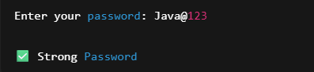

# 📅 Day 11 — Password Validator

### Validating User Input Using String Conditions in Java

---

## 🔗 Quick Navigation

- [🎯 Goal of the Day](#-goal-of-the-day)
- [🧠 Concepts Practiced](#-concepts-practiced)
- [🔐 What I Built](#-what-i-built)
- [📁 Folder Structure](#-folder-structure)
- [⚙️ Validation Logic Explained](#️-validation-logic-explained)
- [🖼️ Working Output](#️-working-output)
- [📝 Notes & Observations](#-notes--observations)
- [💡 Key Takeaways](#-key-takeaways)
- [🎯 Interview Preparation](#-interview-preparation-day-11-level)
- [⏭️ What’s Next?](#️-whats-next)

---

## 🎯 Goal of the Day

The goal of **Day 11** is to build a **Password Validator** that checks whether a password is strong or not using multiple conditions.

This project focuses on:

- String traversal
- Character checking
- Input validation logic
- Writing clean validation methods

---

## 🧠 Concepts Practiced

### Core Java Concepts

- `String` methods
- `length()`
- `charAt()`
- `if-else`
- Loops
- Boolean flags

### Logical Skills

- Multi-condition validation
- Pattern-based checking
- Clean method design

---

## 🔐 What I Built

A **console-based password strength validator** that checks:

✔ Minimum length (8 characters)  
✔ At least one uppercase letter  
✔ At least one lowercase letter  
✔ At least one digit  
✔ At least one special character

📌 Real-world relevant  
📌 Input validation logic  
📌 Interview-friendly implementation

---

## 📁 Folder Structure

Day-11-Password-Validator/
├── README.md  
├── NOTES.md  
├── assets/  
│ └── output.png  
└── src/  
 └── PasswordValidator.java

---

## ⚙️ Validation Logic Explained

Take password input from user

Check length of password

Traverse each character and detect:

- Uppercase letter
- Lowercase letter
- Digit
- Special character

If all conditions are satisfied → Strong Password ✅  
Else → Weak Password ❌

This simulates **real application validation flow**.

---

## 🖼️ Working Output

📸 Example run:

👉 View Output Screenshot

---

## 📝 Notes & Observations

String traversal allows character-level validation

Boolean flags simplify multi-condition checks

Validation logic is widely used in real applications

Method-based design improves readability

---

## 💡 Key Takeaways

Password validation is a real-world use case

Clean logic makes code scalable

Breaking problem into conditions makes it simple

String handling is a must-know Java skill

---

## 🎯 Interview Preparation (Day 11 Level)

**Q1. How do you check each character in a string?**  
Using a loop and `charAt()` method.

**Q2. Why use boolean variables in validation?**  
To track whether each condition is satisfied.

**Q3. Can this be implemented using regex?**  
Yes, but this approach improves logic building.

**Q4. Where is this used in real applications?**  
Signup & login systems.

---

## ⏭️ What’s Next?

### 👉 Day 12 – Email Validator (Advanced String Validation)

Focus areas:

String patterns  
Input filtering  
Real-world validation logic

 

➡️ Go to Day 12

---
